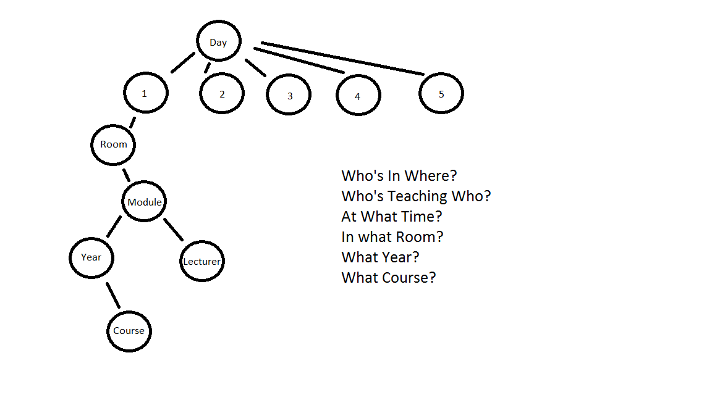
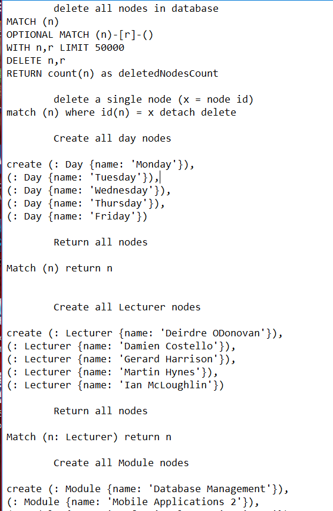
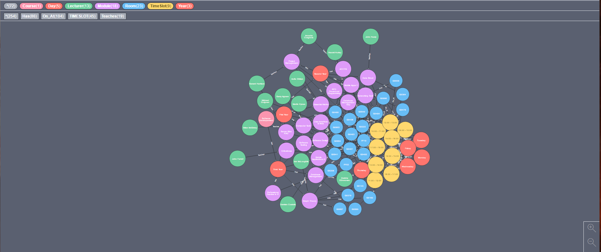

# Neo4JDatabase
Neo4j database for use in a timetabling system for a third level institute like GMIT. To be submitted as Graph Theory Project due April 23rd 2017.

## Author
Karle Sleith

## Purpose
The purpose of this assignment is to create a protoype database, using data from GMIT. The database
should store information about student groups, classrooms, lecturers, and
work hours. 

## Design

The idea for the design was to use a tree hirearchy, with the Day being the root. I had to ask the questions, whats the MAX hours in a school day, what classes are on at what time?, who's in thoses classes? ect, with that I was able to come up with a basic design for my Database.

## Implementation
I decided that the best way to keep track of what I was doing was to use simple .txt files that I would write the syntax in, then copy the information into my Neo4J Database, I made a text file for each year in Software Devleopment, starting with my own year, Year 3.

To find the data I needed for my DataBase, I scraped the Room Information from <a href="http://timetable.gmit.ie">http://timetable.gmit.ie/<a/>, after which I removed the unnecessary code, and replaced it with my own Using "Find and Replace" to allow me to make Nodes for every room in one long command, after I was done I Created the adddional nodes I needed one by one; Lecturers, Course, Year, Day, TimeSlot. 

After creating the Nodes, I continued to create the relationships between, I created a syntax template and was able to replace the information as needed to create the connected Database.

When I was finished I deleted the remaining room nodes that had no relationships.

